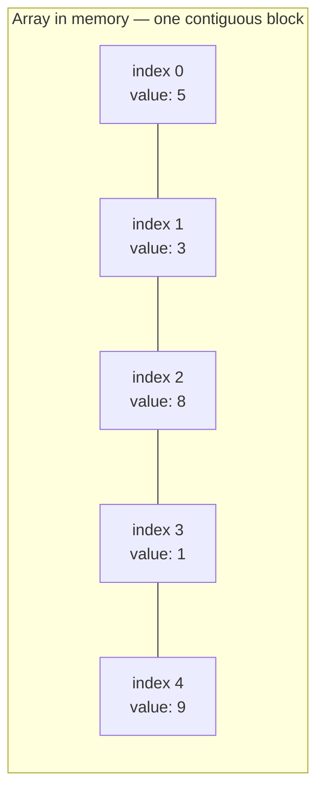
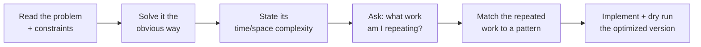

# Module 1 — Arrays & Complexity Foundations

## What you'll learn

Arrays are the first module because every other data structure in this repo is either built on top of one (dynamic arrays, hash tables) or defined in contrast to one (linked lists exist specifically to fix arrays' insert/delete weakness). Before you touch a single problem, you need the mental model of *why* arrays behave the way they do — that model is what lets you predict complexity before you write a single line of code.

By the end of this module you will:
- Know exactly which array operations are O(1) and which are O(n), and *why* — from the memory layout, not from memorization
- Be able to go from brute force to optimized on sight for the most common array patterns: Kadane's algorithm, prefix/suffix products, in-place pointer tricks, and matrix simulation
- Recognize when a problem is secretly a hashing problem wearing an "array" costume (this shows up constantly — see Two Sum)

## Why arrays behave the way they do

Because the elements sit back-to-back in memory, the computer can jump straight to any index with simple arithmetic (`base_address + index * element_size`) — that's why **access is O(1)**. But that same contiguity is what makes **insertion/deletion in the middle O(n)**: every element after the gap has to physically shift over to close (or open) the space.

## Complexity cheat sheet

| Operation | Time Complexity | Why |
|---|---|---|
| Access by index | O(1) | Direct address calculation |
| Search (unsorted) | O(n) | Must check every element in the worst case |
| Search (sorted) | O(log n) | Binary search — see Module 7 |
| Insert/delete at the end | O(1) amortized | No shifting needed (dynamic arrays double capacity) |
| Insert/delete at start/middle | O(n) | Every subsequent element must shift |

## The brute-force-first method

Every README in this module (and every module after it) follows the same problem-solving loop. Internalize this — it's the actual interview skill, more than any single algorithm:

Constraints matter more than most people think: if `n <= 10^4`, an O(n²) brute force (~10⁸ ops) might actually pass. If `n <= 10^6`, it won't — you *need* O(n) or O(n log n). Always check constraints before deciding whether "brute force" is actually good enough.

## Sub-patterns covered in this module

| Pattern | One-line idea |
|---|---|
| Kadane's Algorithm | At each index, decide: extend the running subarray, or restart from here |
| Prefix / Suffix Product | Precompute left-to-right and right-to-left passes, then combine |
| In-Place Write Pointer | One pointer reads, one writes — avoids allocating a second array |
| Index Marking | Use the array's own values as indices to record "seen," in O(1) extra space |
| Boyer-Moore Voting | Cancel opposing "votes" in a single pass to find a majority |
| Matrix Simulation | Walk a grid using shrinking boundaries instead of a visited-set |

## Problems in this module

| # | Problem | Difficulty | Pattern |
|---|---|---|---|
| 1 | [Two Sum](./problems/01-two-sum) | Easy | Hashing — Complement Search |
| 2 | [Contains Duplicate](./problems/02-contains-duplicate) | Easy | Hashing — Membership Check |
| 3 | [Best Time to Buy and Sell Stock](./problems/03-best-time-to-buy-and-sell-stock) | Easy | Single-Pass Greedy Tracking |
| 4 | [Maximum Subarray](./problems/04-maximum-subarray) | Medium | Kadane's Algorithm |
| 5 | [Maximum Product Subarray](./problems/05-maximum-product-subarray) | Medium | Kadane's Variant (max/min tracking) |
| 6 | [Move Zeroes](./problems/06-move-zeroes) | Easy | In-Place Write Pointer |
| 7 | [Rotate Array](./problems/07-rotate-array) | Medium | In-Place Rotation via Reversal |
| 8 | [Product of Array Except Self](./problems/08-product-of-array-except-self) | Medium | Prefix / Suffix Product |
| 9 | [Find All Numbers Disappeared in an Array](./problems/09-find-disappeared-numbers) | Easy | Index Marking |
| 10 | [Missing Number](./problems/10-missing-number) | Easy | Math — Gauss Sum |
| 11 | [Majority Element](./problems/11-majority-element) | Easy | Boyer-Moore Voting |
| 12 | [Set Matrix Zeroes](./problems/12-set-matrix-zeroes) | Medium | In-Place Matrix Marking |
| 13 | [Spiral Matrix](./problems/13-spiral-matrix) | Medium | Boundary Simulation |
| 14 | [Rotate Image](./problems/14-rotate-image) | Medium | In-Place Transpose + Reverse |
| 15 | [Next Permutation](./problems/15-next-permutation) | Medium | Permutation Algorithm |

**Suggested order:** top to bottom. Problems 1–3 warm up the "brute force vs. optimized" muscle with simple single-pass logic. 4–5 introduce Kadane's. 6–11 are pure in-place array tricks. 12–15 move into 2D matrices to close out the module.

## Up next

**Module 2 — Strings.** Strings are character arrays with extra rules (immutability, encoding). You'll reuse everything from this module — especially in-place pointer tricks and hashing — applied to text.
