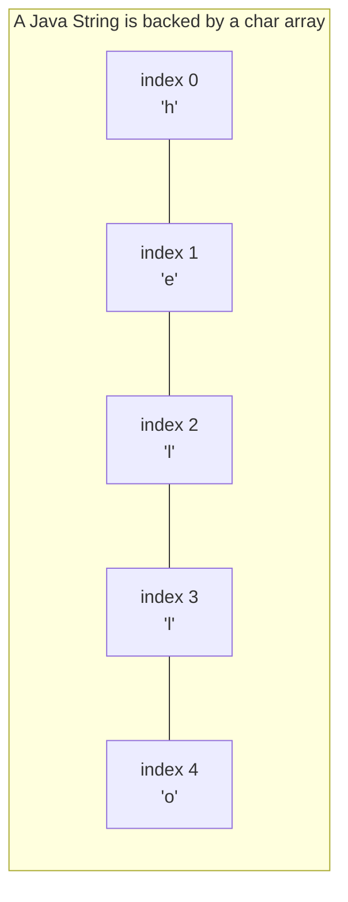
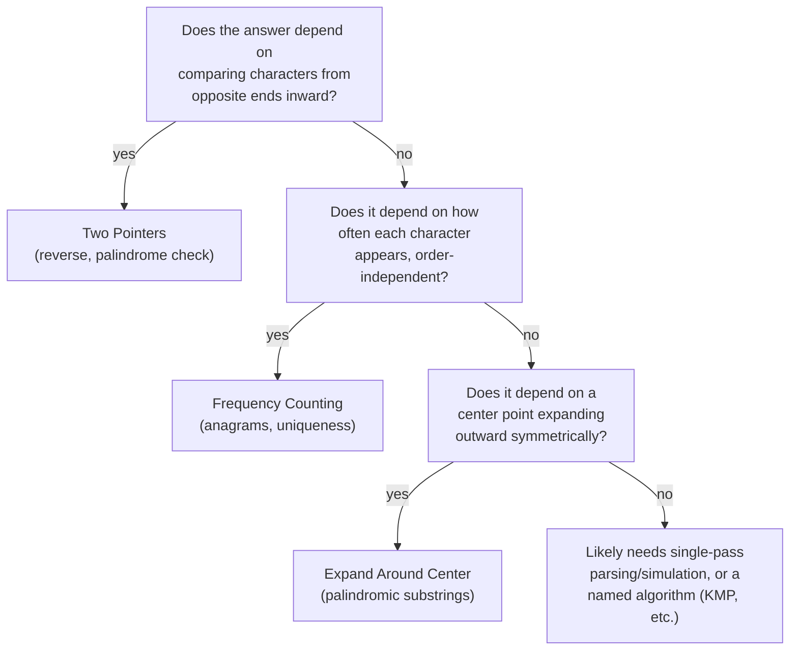

# Module 2 — Strings

## What you'll learn

Strings are arrays of characters with a few extra rules bolted on: in Java they're immutable (every "modification" actually creates a new object), and text brings its own vocabulary of problems — palindromes, anagrams, prefix matching, and manual arithmetic on digit strings. Everything you learned in Module 1 (two-pointer swaps, in-place write pointers, frequency counting) reappears here, applied to text instead of numbers.

By the end of this module you will:
- Reflexively reach for two pointers whenever a string problem mentions "palindrome" or "reverse"
- Know when a HashMap of character frequencies solves a problem outright (anagrams, uniqueness)
- Recognize the "expand around center" technique for any palindromic-substring problem
- Understand why Java's `String` immutability matters for complexity analysis, and how to reason about "in-place" on a `char[]` instead
- Have implemented KMP once, so "how would you do this faster than brute force" doesn't catch you off guard on substring search

## Why strings inherit from arrays

The access pattern is identical to Module 1's array diagram — O(1) indexed access, O(n) search. The one crucial difference: in Java, `String` itself is **immutable**. Every `substring()`, `+`, or `.replace()` call allocates a new object. That's why several "brute force" solutions in this module are labeled that way not because they're asymptotically slower, but because they allocate far more intermediate objects than a version working on a mutable `char[]` — a distinction interviewers frequently probe for directly ("can you do this without extra string allocations?").

## The two-phase mental model for string problems

A large fraction of string problems reduce to one of these shapes — recognizing which one you're looking at tells you which pattern to reach for:

## Sub-patterns covered in this module

| Pattern | One-line idea |
|---|---|
| Two-Pointer Swap / Filtering | Converge from both ends, optionally skipping characters that don't count |
| Character Frequency Counting | A fixed-size array or HashMap answers "same composition, any order?" |
| Bijective HashMap Mapping | Two hashmaps enforce a mapping is consistent in *both* directions |
| Hashing by Canonical Key | Group items whose shared property can be reduced to one comparable key |
| In-Place Write Pointer | Compact or transform a char array using a read/write pointer pair |
| Reversal Composition | Reverse the whole, then reverse the pieces, to reorder groups in O(1) space |
| Expand Around Center | Grow outward from every possible palindrome center, count or track the best |
| KMP (Knuth-Morris-Pratt) | Use a precomputed failure function so substring search never backtracks the main pointer |

## Problems in this module

| # | Problem | Difficulty | Pattern |
|---|---|---|---|
| 1 | [Reverse String](./problems/01-reverse-string) | Easy | Two-Pointer Swap |
| 2 | [Valid Palindrome](./problems/02-valid-palindrome) | Easy | Two-Pointer + Filtering |
| 3 | [Valid Anagram](./problems/03-valid-anagram) | Easy | Character Frequency Counting |
| 4 | [First Unique Character in a String](./problems/04-first-unique-character) | Easy | Frequency Counting + Single Pass |
| 5 | [Isomorphic Strings](./problems/05-isomorphic-strings) | Easy | Bijective HashMap Mapping |
| 6 | [Group Anagrams](./problems/06-group-anagrams) | Medium | Hashing by Canonical Key |
| 7 | [Longest Common Prefix](./problems/07-longest-common-prefix) | Easy | Horizontal / Vertical Scanning |
| 8 | [String Compression](./problems/08-string-compression) | Medium | In-Place Write Pointer |
| 9 | [Reverse Words in a String](./problems/09-reverse-words-in-a-string) | Medium | Reversal Composition |
| 10 | [Roman to Integer](./problems/10-roman-to-integer) | Easy | HashMap Lookup + Lookahead |
| 11 | [Integer to Roman](./problems/11-integer-to-roman) | Medium | Greedy Symbol Table / Digit Lookup |
| 12 | [Implement strStr()](./problems/12-implement-strstr) | Easy | Brute Match -> KMP |
| 13 | [Longest Palindromic Substring](./problems/13-longest-palindromic-substring) | Medium | Expand Around Center |
| 14 | [Palindromic Substrings](./problems/14-palindromic-substrings) | Medium | Expand Around Center |
| 15 | [Multiply Strings](./problems/15-multiply-strings) | Medium | Digit-by-Digit Multiplication |

**Suggested order:** top to bottom. Problems 1–5 build the two core toolkits (two pointers, frequency counting) on easy problems. 6–9 apply those toolkits to slightly meatier transformations. 10–12 are parsing/matching problems that lean on lookup tables and, in #12, a genuinely new algorithm (KMP). 13–15 close the module with the "expand around center" technique and a full manual-arithmetic simulation.

## Up next

**Module 3 — Two Pointers.** You've already used two pointers informally throughout this module (Reverse String, Valid Palindrome, String Compression). Module 3 makes it the main event: opposite-direction pointers, fast/slow pointers, and three-way partitioning, applied to general arrays rather than just text.
