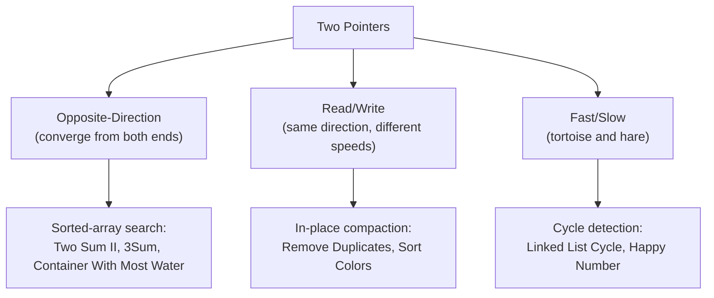
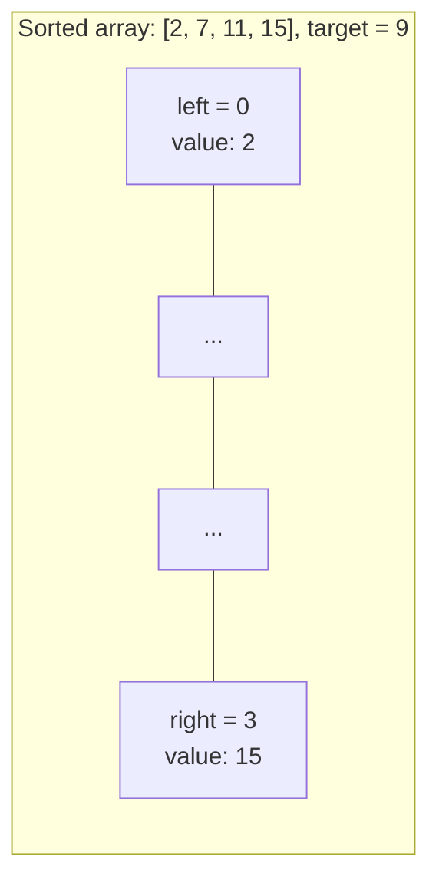

# Module 3 — Two Pointers

## What you'll learn

You've already been using two pointers informally — Reverse String, Valid Palindrome, Move Zeroes, and String Compression all leaned on the idea without naming it. This module makes it the main event, and pushes it further: opposite-direction pointers for search problems, read/write pointers for in-place compaction, three-way partitioning for multi-group sorting, and fast/slow pointers for a completely different class of problem — detecting cycles in sequences, including your first taste of linked lists.

By the end of this module you will:
- Know exactly which two-pointer variant a problem calls for, just from its shape (sorted-array search, in-place compaction, cycle detection, or greedy pairing)
- Understand *why* sortedness is what unlocks two pointers for search problems — and be able to explain the greedy proof, not just apply the trick
- Have implemented Floyd's Cycle Detection (fast/slow pointers) three different ways: on a linked list, to find a cycle's start, and on a plain number sequence
- Be comfortable combining sorting with two pointers to reduce a "triple nested loop" problem (3Sum) down to O(n^2)

## The three families of two pointers

Every problem in this module fits one of these three shapes. Learning to classify a new problem into the right family — before writing any code — is the actual skill.

## Why sortedness unlocks opposite-direction pointers

If `nums[left] + nums[right]` is too small, moving `right` left can only make it smaller — the only productive move is `left` forward, toward larger values. If the sum is too big, the symmetric logic applies to `right`. This monotonic guarantee is exactly what a hashmap-based solution (Module 1's Two Sum) doesn't need — but also exactly what lets two pointers replace it here with zero extra space.

## Sub-patterns covered in this module

| Pattern | One-line idea |
|---|---|
| Opposite-Direction Two Pointers | Converge from both ends of a sorted structure, moving based on a comparison |
| Read/Write Two Pointers | Compact or filter an array in-place using pointers moving at different rates |
| Three-Pointer Partitioning | Sort into three known groups in a single pass (Dutch National Flag) |
| Fast/Slow Pointers | Detect cycles, or find a sequence's midpoint, using pointers of different speeds |
| Sort + Two Pointers | Fix one element via a loop, solve the rest with opposite-direction pointers |

## Problems in this module

| # | Problem | Difficulty | Pattern |
|---|---|---|---|
| 1 | [Two Sum II - Input Array Is Sorted](./problems/01-two-sum-ii-sorted) | Easy | Opposite-Direction Two Pointers |
| 2 | [Valid Palindrome II](./problems/02-valid-palindrome-ii) | Easy | Two Pointers + One Allowed Deletion |
| 3 | [Squares of a Sorted Array](./problems/03-squares-of-sorted-array) | Easy | Opposite-Direction Two Pointers |
| 4 | [Remove Duplicates from Sorted Array](./problems/04-remove-duplicates-sorted-array) | Easy | Read/Write Two Pointers |
| 5 | [Remove Duplicates from Sorted Array II](./problems/05-remove-duplicates-sorted-array-ii) | Medium | Read/Write Two Pointers |
| 6 | [Sort Colors](./problems/06-sort-colors) | Medium | Three-Pointer Partitioning |
| 7 | [Container With Most Water](./problems/07-container-with-most-water) | Medium | Opposite-Direction Two Pointers |
| 8 | [3Sum](./problems/08-3sum) | Medium | Sort + Two Pointers |
| 9 | [3Sum Closest](./problems/09-3sum-closest) | Medium | Sort + Two Pointers |
| 10 | [Trapping Rain Water](./problems/10-trapping-rain-water) | Hard | Two Pointers |
| 11 | [Middle of the Linked List](./problems/11-middle-of-linked-list) | Easy | Fast/Slow Pointers |
| 12 | [Linked List Cycle](./problems/12-linked-list-cycle) | Easy | Fast/Slow Pointers |
| 13 | [Linked List Cycle II](./problems/13-linked-list-cycle-ii) | Medium | Fast/Slow Pointers |
| 14 | [Happy Number](./problems/14-happy-number) | Easy | Fast/Slow Pointers |
| 15 | [Boats to Save People](./problems/15-boats-to-save-people) | Medium | Sort + Two Pointers |

**Suggested order:** top to bottom. Problems 1–3 build the opposite-direction fundamentals on easy problems. 4–6 shift to read/write and three-way partitioning. 7–10 return to opposite-direction pointers on progressively harder problems, closing with two Hard-adjacent classics. 11–14 pivot entirely to fast/slow pointers, previewing Module 5's linked lists. 15 closes with a greedy two-pointer capstone.

## Up next

**Module 4 — Sliding Window.** A specialized two-pointer technique where both pointers move in the *same* direction, expanding and shrinking a window over a subarray or substring. If a problem mentions "longest," "smallest," or "contains all of" in the context of a contiguous range, that's Module 4.
