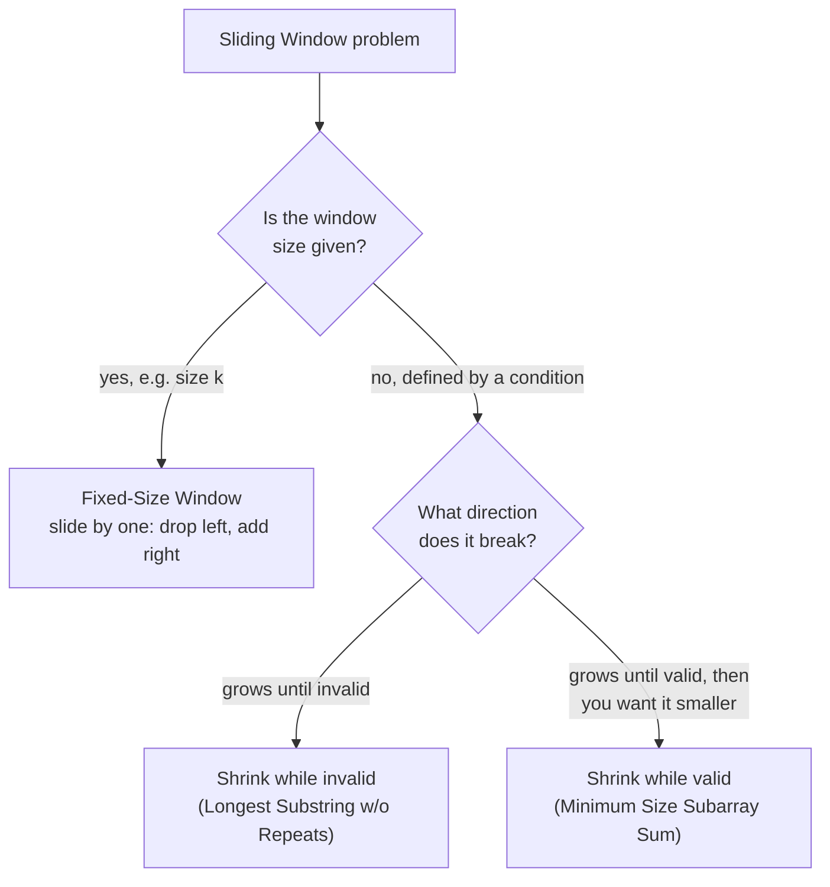

# Module 4 — Sliding Window

## What you'll learn

Sliding Window is a specialized two-pointer technique: instead of pointers converging from opposite ends (Module 3), both pointers move in the *same* direction, expanding and shrinking a contiguous range over an array or string. Whenever a problem mentions "longest," "shortest," "maximum sum/product," or "contains all of" in the context of a *contiguous* subarray or substring, this is the module to reach for.

By the end of this module you will:
- Instantly distinguish fixed-size windows (the size is given) from variable-size windows (the size is whatever satisfies a condition)
- Know the "shrink while invalid" vs. "shrink while valid" distinction, and why Minimum Window Substring needs both ideas at once
- Understand the exactly(K) = atMost(K) - atMost(K-1) trick for counting problems that don't fit a simple grow/shrink shape
- Have implemented a monotonic deque, the structure that makes Sliding Window Maximum possible in O(n)

## Fixed vs. variable windows

Every problem in this module fits one branch of this tree. Before writing any code, ask: is the size fixed, and if not, which direction does validity break?

## Sub-patterns covered in this module

| Pattern | One-line idea |
|---|---|
| Fixed-Size Window | Slide by exactly one position: subtract what leaves, add what enters |
| Variable-Size Window (shrink while invalid) | Grow until a condition breaks, then shrink just enough to fix it |
| Variable-Size Window (shrink while valid) | Grow until a condition first holds, then shrink as far as it still holds |
| Window + Frequency Count | Track a HashMap or fixed array of counts as the window's content changes |
| "Exactly K" via "At Most K" Subtraction | Reduce a hard-to-track-directly condition to two easier counting passes |
| Monotonic Deque | Maintain candidates in sorted order so the window's max/min is always at the front |

## Problems in this module

| # | Problem | Difficulty | Pattern |
|---|---|---|---|
| 1 | [Maximum Sum Subarray of Size K](./problems/01-max-sum-subarray-size-k) | Easy | Fixed-Size Window |
| 2 | [Repeated DNA Sequences](./problems/02-repeated-dna-sequences) | Medium | Fixed-Size Window + Hashing |
| 3 | [Permutation in String](./problems/03-permutation-in-string) | Medium | Fixed-Size Window + Frequency Count |
| 4 | [Find All Anagrams in a String](./problems/04-find-all-anagrams-in-a-string) | Medium | Fixed-Size Window + Frequency Count |
| 5 | [Longest Substring Without Repeating Characters](./problems/05-longest-substring-without-repeating) | Medium | Variable-Size Window + HashMap |
| 6 | [Longest Substring with At Most K Distinct Characters](./problems/06-longest-substring-at-most-k-distinct) | Medium | Variable-Size Window + HashMap |
| 7 | [Fruit Into Baskets](./problems/07-fruit-into-baskets) | Medium | Variable-Size Window (k=2) |
| 8 | [Minimum Size Subarray Sum](./problems/08-minimum-size-subarray-sum) | Medium | Variable-Size Window |
| 9 | [Longest Repeating Character Replacement](./problems/09-longest-repeating-character-replacement) | Medium | Variable-Size Window + Frequency Count |
| 10 | [Max Consecutive Ones III](./problems/10-max-consecutive-ones-iii) | Medium | Variable-Size Window |
| 11 | [Longest Subarray of 1's After Deleting One Element](./problems/11-longest-subarray-after-deleting-one) | Medium | Variable-Size Window (k=1 + adjust) |
| 12 | [Subarray Product Less Than K](./problems/12-subarray-product-less-than-k) | Medium | Variable-Size Window (counting) |
| 13 | [Count Number of Nice Subarrays](./problems/13-count-nice-subarrays) | Medium | "Exactly K" via "At Most K" |
| 14 | [Minimum Window Substring](./problems/14-minimum-window-substring) | Hard | Variable-Size Window + HashMap |
| 15 | [Sliding Window Maximum](./problems/15-sliding-window-maximum) | Hard | Monotonic Deque |

**Suggested order:** top to bottom. Problems 1–4 build fixed-window fundamentals. 5–11 build variable-window fundamentals, progressively adding frequency tracking and more complex validity conditions. 12–13 introduce the counting variant. 14–15 close with two Hard capstones that combine everything.

## Up next

**Module 5 — Linked Lists.** You've already previewed fast/slow pointers on linked lists in Module 3. Module 5 goes deep: in-place reversal, the dummy-head technique, and merging — the toolkit for nearly every linked list problem you'll see in an interview.
