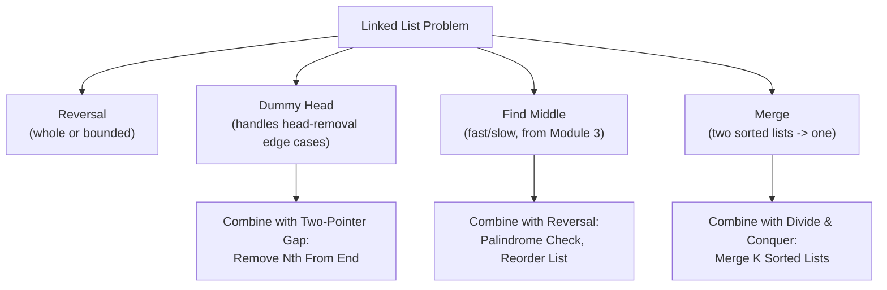
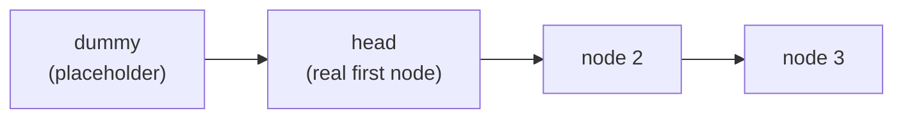

# Module 5 — Linked Lists

## What you'll learn

You previewed fast/slow pointers on linked lists in Module 3. This module goes deep on everything else: in-place reversal, the dummy-head technique that eliminates head-of-list edge cases, and the merge/split operations that power most "hard" linked-list interview questions. By the end, a linked list problem should immediately decompose in your head into a small number of these building blocks, chained together.

By the end of this module you will:
- Reverse a list (whole or bounded range) without hesitating over pointer order
- Reach for a dummy head automatically whenever a problem might delete or replace the head node
- Recognize when a problem is really "find the middle, then do something to each half" (palindrome check, reorder, merge sort on a list)
- Combine simple building blocks (reverse + find-middle + merge) into solutions for Hard-rated problems like Reorder List and Merge K Sorted Lists

## The building-block toolkit

Almost every problem in this module is one building block, or two of them chained together. Learning to spot which ones apply — before writing any pointer code — is the actual skill.

## Why the dummy head matters

Without a dummy node, "what if the node I need to remove/modify is the head itself" becomes a special case in almost every removal or reordering problem. With a dummy node sitting *before* the real head, the head is never structurally special — you always operate on `dummy.next` and return it at the end.

## Sub-patterns covered in this module

| Pattern | One-line idea |
|---|---|
| In-Place Reversal | Flip `next` pointers using prev/curr/next references, iteratively |
| Dummy Head | A placeholder node before the real head, eliminating head-edge-case logic |
| Two-Pointer Gap | Advance one pointer n steps ahead, then move both together |
| Carry Simulation | Walk two lists simultaneously, tracking a carry like manual addition |
| Fast/Slow + Reversal | Find the middle, then reverse one half to enable "backward" access |
| Divide & Conquer Merge | Repeatedly merge pairs to combine many sorted lists efficiently |

## Problems in this module

| # | Problem | Difficulty | Pattern |
|---|---|---|---|
| 1 | [Reverse Linked List](./problems/01-reverse-linked-list) | Easy | In-Place Reversal |
| 2 | [Merge Two Sorted Lists](./problems/02-merge-two-sorted-lists) | Easy | Dummy Head + Merge |
| 3 | [Remove Duplicates from Sorted List](./problems/03-remove-duplicates-sorted-list) | Easy | Single-Pass Pointer |
| 4 | [Remove Nth Node From End of List](./problems/04-remove-nth-node-from-end) | Medium | Two-Pointer Gap + Dummy Head |
| 5 | [Swap Nodes in Pairs](./problems/05-swap-nodes-in-pairs) | Medium | In-Place Pointer Manipulation |
| 6 | [Odd Even Linked List](./problems/06-odd-even-linked-list) | Medium | Two-Pointer Partitioning |
| 7 | [Reverse Linked List II](./problems/07-reverse-linked-list-ii) | Medium | Bounded In-Place Reversal |
| 8 | [Remove Duplicates from Sorted List II](./problems/08-remove-duplicates-sorted-list-ii) | Medium | Dummy Head + Skip Logic |
| 9 | [Add Two Numbers](./problems/09-add-two-numbers) | Medium | Dummy Head + Carry Simulation |
| 10 | [Intersection of Two Linked Lists](./problems/10-intersection-of-two-linked-lists) | Easy | Two Pointers (Switch Heads) |
| 11 | [Palindrome Linked List](./problems/11-palindrome-linked-list) | Easy | Fast/Slow + Reversal |
| 12 | [Reorder List](./problems/12-reorder-list) | Medium | Fast/Slow + Reversal + Merge |
| 13 | [Rotate List](./problems/13-rotate-list) | Medium | Circular Link + Break |
| 14 | [Copy List with Random Pointer](./problems/14-copy-list-with-random-pointer) | Medium | HashMap Mapping / Interweaving |
| 15 | [Merge K Sorted Lists](./problems/15-merge-k-sorted-lists) | Hard | Divide & Conquer Merge |

**Suggested order:** top to bottom. Problems 1–3 build the fundamentals (reversal, dummy head, single-pointer walks). 4–9 combine those fundamentals in increasingly involved ways. 10–13 lean on fast/slow pointers and structural tricks (switching heads, making a list circular). 14–15 close with two harder problems that chain multiple techniques together.

## Up next

**Module 6 — Stacks & Queues.** LIFO and FIFO structures that power parenthesis matching, expression evaluation, and the monotonic stack pattern — the tool for a huge class of "next greater element"-style problems.
