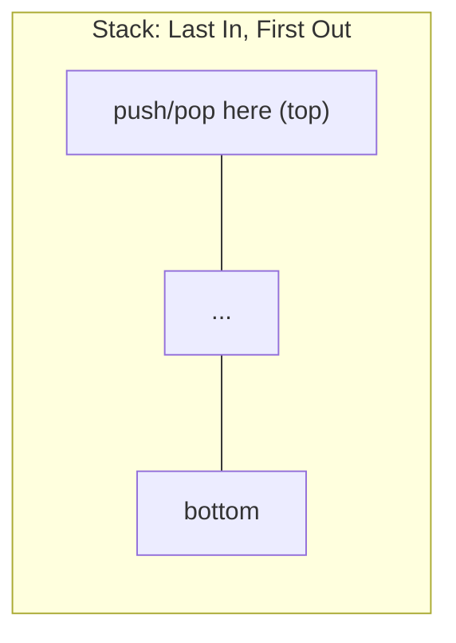
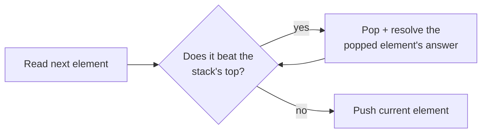

# Module 6 — Stacks & Queues

## What you'll learn

Stacks (LIFO) and queues (FIFO) are the simplest possible data structures, but they power a surprisingly large slice of interview problems: bracket matching, expression evaluation, nested-structure parsing, and — the single highest-leverage pattern in this module — the **monotonic stack**, which turns a whole family of "next greater/smaller element" problems from O(n²) into O(n).

By the end of this module you will:
- Reach for a stack the instant a problem involves nesting, matching, or "does the most recent thing cancel with what's next"
- Recognize the monotonic stack shape on sight, across five different problems that all reduce to the same core loop
- Understand why a monotonic stack turns an O(n²) "next greater element" search into O(n) — each element is pushed once and popped at most once
- Have implemented both directions of the classic "build X using only Y" interview question (queue from stacks, stack from queues)

## Why LIFO unlocks nested-structure problems

Nested structures (brackets, encoded strings, arithmetic sub-expressions) resolve inside-out: the *most recently opened* thing must be the *next* thing closed. That's exactly what a stack's LIFO order guarantees for free — no extra bookkeeping needed to track "which context am I in."

## The monotonic stack shape

Five problems in this module — Daily Temperatures, Next Greater Element I & II, Online Stock Span, and Largest Rectangle in Histogram — all reduce to the same loop:

Once you can recognize this shape, "next greater," "next smaller," "how many days until," and "how wide can this rectangle grow" all stop looking like different problems.

## Sub-patterns covered in this module

| Pattern | One-line idea |
|---|---|
| Stack Matching | Push openers, pop-and-check on closers/cancellation triggers |
| Stack + Auxiliary Tracking | A second parallel stack maintains a running extreme value in O(1) |
| Monotonic Stack | Maintain candidates in sorted order so "next greater/smaller" resolves in O(1) amortized |
| Stack-Based Evaluation | Numbers get pushed, operators pop and combine, respecting order or precedence |
| Stack Simulation | Model a real process (collisions, nested decoding) as push/pop/cancel operations |
| Two-Structure Design | Combine two stacks or two queues to simulate the opposite discipline |

## Problems in this module

| # | Problem | Difficulty | Pattern |
|---|---|---|---|
| 1 | [Valid Parentheses](./problems/01-valid-parentheses) | Easy | Stack Matching |
| 2 | [Min Stack](./problems/02-min-stack) | Medium | Stack + Auxiliary Tracking |
| 3 | [Remove All Adjacent Duplicates In String](./problems/03-remove-adjacent-duplicates) | Easy | Stack Matching |
| 4 | [Evaluate Reverse Polish Notation](./problems/04-evaluate-rpn) | Medium | Stack-Based Evaluation |
| 5 | [Daily Temperatures](./problems/05-daily-temperatures) | Medium | Monotonic Stack |
| 6 | [Next Greater Element I](./problems/06-next-greater-element-i) | Easy | Monotonic Stack + HashMap |
| 7 | [Next Greater Element II](./problems/07-next-greater-element-ii) | Medium | Monotonic Stack (Circular) |
| 8 | [Online Stock Span](./problems/08-online-stock-span) | Medium | Monotonic Stack (Streaming) |
| 9 | [Asteroid Collision](./problems/09-asteroid-collision) | Medium | Stack Simulation |
| 10 | [Decode String](./problems/10-decode-string) | Medium | Stack-Based Nested Parsing |
| 11 | [Basic Calculator II](./problems/11-basic-calculator-ii) | Medium | Stack-Based Expression Evaluation |
| 12 | [Largest Rectangle in Histogram](./problems/12-largest-rectangle-histogram) | Hard | Monotonic Stack |
| 13 | [Implement Queue using Stacks](./problems/13-implement-queue-using-stacks) | Easy | Two-Stack Simulation |
| 14 | [Implement Stack using Queues](./problems/14-implement-stack-using-queues) | Easy | Single-Queue Rotation |
| 15 | [Design Circular Queue](./problems/15-design-circular-queue) | Medium | Array-Based Circular Buffer |

**Suggested order:** top to bottom. Problems 1–4 build stack fundamentals (matching, auxiliary tracking, evaluation). 5–9 are the monotonic-stack core of the module. 10–12 apply stacks to parsing and close with a Hard capstone. 13–15 flip the lens to queue design and the classic "implement X with Y" interview staples.

## Up next

**Module 7 — Binary Search.** Not just "find a value in a sorted array" — binary search on an answer space is one of the most underused optimization tricks in interviews, and this module covers both the classic array search and that more general technique.
