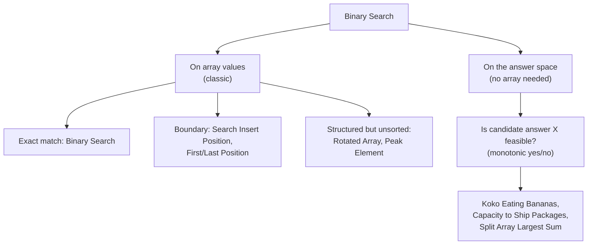

# Module 7 — Binary Search

## What you'll learn

Binary search is usually taught as "find a value in a sorted array" and left there — but that's only half the technique. The other half, binary search **on an answer space**, is one of the most underused optimization tricks in interviews: any time a yes/no feasibility check is monotonic across a range of possible answers, you can binary search that range directly, even when there's no array in sight.

By the end of this module you will:
- Write binary search correctly on the first try, including the off-by-one details that trip people up (`<=` vs `<`, `mid+1` vs `mid`)
- Recognize when an array isn't fully sorted but still has enough structure for a modified binary search (rotated arrays, peak finding)
- Spot the "minimize/maximize X such that a condition holds" phrasing that signals binary search on the answer
- Have implemented Median of Two Sorted Arrays — a Hard problem that becomes tractable once you see it as binary search on a partition point, not a value

## Two flavors of binary search

Before writing any code, ask: am I searching for a value that's already sitting in an array, or am I searching for the best value in some range of *possible answers*, checked by a feasibility function? The loop looks almost identical either way — but recognizing which one you're in tells you what `left`, `right`, and the comparison inside the loop actually mean.

## Sub-patterns covered in this module

| Pattern | One-line idea |
|---|---|
| Classic Binary Search | Halve the search space using direct comparison to a sorted array's middle element |
| Boundary Search (Lower Bound) | Narrow toward the leftmost/rightmost position satisfying a condition, not just any match |
| Modified Binary Search (Rotated Array) | Identify which half is genuinely sorted, then decide which half to search |
| Binary Search on the Answer | Binary search a range of candidate answers using a monotonic feasibility check |
| Staircase Search | Eliminate a whole row or column per comparison in a row/column-sorted (not fully sorted) matrix |
| Binary Search on a Partition | Search for a split point satisfying an ordering condition across two data sources |

## Problems in this module

| # | Problem | Difficulty | Pattern |
|---|---|---|---|
| 1 | [Binary Search](./problems/01-binary-search) | Easy | Classic Binary Search |
| 2 | [Search Insert Position](./problems/02-search-insert-position) | Easy | Boundary Search (Lower Bound) |
| 3 | [First and Last Position of Element in Sorted Array](./problems/03-first-last-position) | Medium | Boundary Search, Twice |
| 4 | [Search in Rotated Sorted Array](./problems/04-search-rotated-sorted-array) | Medium | Modified Binary Search |
| 5 | [Search in Rotated Sorted Array II](./problems/05-search-rotated-sorted-array-ii) | Medium | Modified Binary Search + Duplicates |
| 6 | [Find Minimum in Rotated Sorted Array](./problems/06-find-minimum-rotated-sorted-array) | Medium | Modified Binary Search (Find Pivot) |
| 7 | [Find Peak Element](./problems/07-find-peak-element) | Medium | Binary Search on the Slope |
| 8 | [Sqrt(x)](./problems/08-sqrt-x) | Easy | Binary Search on the Answer |
| 9 | [Koko Eating Bananas](./problems/09-koko-eating-bananas) | Medium | Binary Search on the Answer |
| 10 | [Capacity To Ship Packages Within D Days](./problems/10-capacity-to-ship-packages) | Medium | Binary Search on the Answer |
| 11 | [Search a 2D Matrix](./problems/11-search-2d-matrix) | Medium | Binary Search (Flattened) |
| 12 | [Search a 2D Matrix II](./problems/12-search-2d-matrix-ii) | Medium | Staircase Search |
| 13 | [Find K Closest Elements](./problems/13-find-k-closest-elements) | Medium | Binary Search on Window Start |
| 14 | [Median of Two Sorted Arrays](./problems/14-median-of-two-sorted-arrays) | Hard | Binary Search on a Partition |
| 15 | [Split Array Largest Sum](./problems/15-split-array-largest-sum) | Hard | Binary Search on the Answer |

**Suggested order:** top to bottom. Problems 1–3 build classic and boundary-search fundamentals. 4–7 apply binary search to structured-but-not-fully-sorted arrays. 8–10 introduce binary search on the answer space, the module's highest-leverage idea. 11–13 cover matrix and window variants. 14–15 close with two Hard capstones.

## Up next

**Module 8 — Sorting & Searching Patterns.** How your choice of sort (and comparator) changes a problem's complexity, plus interval-merging and quickselect — the last module before recursion, trees, and graphs take over the second half of the curriculum.
